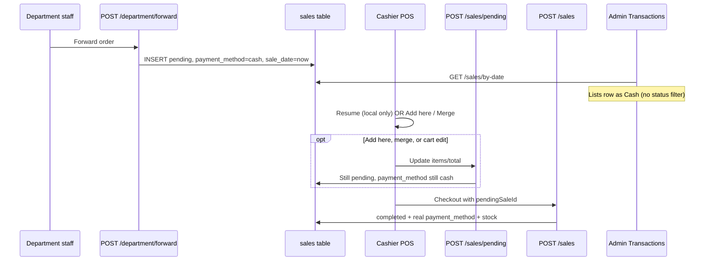

# Department Forward → Cashier Checkout: Flow & Gaps

> **Status**: Audit (merged) · **Date**: 2026-06-17  
> **Supersedes**: [`INVOICE_FORWARDING_GAPS.md`](./INVOICE_FORWARDING_GAPS.md) (redirect only)  
> **Reported issue**: When department staff forwards an invoice and a cashier adds it to cart, the system records it as a cash-paid transaction before checkout is completed.

This document traces the full flow end-to-end, explains why the behaviour looks like a premature cash sale, and scopes every identified gap with fix recommendations and a test plan.

---

## Table of Contents

1. [Intended flow](#1-intended-flow)
2. [Actual flow (step by step)](#2-actual-flow-step-by-step)
3. [Root cause](#3-root-cause)
4. [Gap inventory](#4-gap-inventory)
5. [Reporting: safe vs unsafe endpoints](#5-reporting-safe-vs-unsafe-endpoints)
6. [Recommended fix phases](#6-recommended-fix-phases)
7. [Files reference](#7-files-reference)
8. [Test plan](#8-test-plan)

---

## 1. Intended flow

| Step | Actor | Expected behaviour |
|------|--------|-------------------|
| 1 | Department staff | Builds cart → **Forward** → order appears in cashier queue |
| 2 | System | Creates a **pending** sale row (no payment, no stock deduction) |
| 3 | Cashier | Sees order in POS pending panel → **Resume** or **Add here** |
| 4 | Cashier | Cart links to `pendingSaleId`; optional cart edits sync back to server |
| 5 | Cashier | Completes checkout (cash / M-Pesa / credit / split) |
| 6 | System | Marks sale `completed`, sets real `payment_method`, deducts stock, notifies department staff |

---

## 2. Actual flow (step by step)

### 2.1 Department forwards order

**UI**: `DepartmentAppProvider.submitOrder(forwarded: true)`  
**API**: `POST /api/department/forward`

```text
Department cart
    → POST /api/department/forward
    → INSERT sales (
         status = 'pending',
         payment_method = 'cash',   ← placeholder (see §3)
         sale_date = now,           ← transaction date set immediately
         user_id = department_staff,
         originated_by_user_id = department_staff,
         shift_id = NULL
       )
    → INSERT sale_items (profit/buy = 0; no stock deduction)
    → SSE: order:forwarded + queue:update
```

Department cart is cleared locally. **A `sales` row already exists in the database** — often before any cashier action.

### 2.2 Cashier sees the order

**UI**: `PosPendingSalesPanel` (`departmentOrdersOnly` on cashier cart)  
**API**: `GET /api/sales/pending` (status `pending` only)

Cashiers see all pending sales in the business, including department-forwarded orders (`isDepartmentOrder()`).

### 2.3 Cashier loads order into POS cart

Three entry points in `PosPendingSalesPanel`:

| Action | Cart store method | Server call on load? |
|--------|-------------------|----------------------|
| **Resume** | `restorePendingSale` | **No** — local only, `syncStatus: 'synced'` |
| **Add here** | `mergePendingSaleIntoActiveCart` | **Yes** — debounced `POST /api/sales/pending` (update) |
| **Merge cart** | `mergeActiveCartIntoPendingSale` | **Yes** — debounced `POST /api/sales/pending` (update) |

`POST /api/sales/pending` when `pendingSaleId` is provided:

- Updates `total_amount`, `customer_*`, `updated_at`
- Replaces `sale_items`
- **Does not** change `status`, `payment_method`, `sale_date`, or `user_id`
- **Does not** deduct stock or create `sale_payments`

If `pendingSaleId` is **missing**, the same endpoint **INSERTs a new** pending row with `payment_method = 'cash'` (see **G-22**).

**`POST /api/department/loaded` is never called from the POS UI** (endpoint exists but has no client callers). Department staff never receive “In cart” status.

### 2.4 Cart edits after load

Any `addItem` / `updateQuantity` / `removeItem` on a linked cart schedules `syncPendingSale` → `POST /api/sales/pending`. Still `status = 'pending'`.

### 2.5 Checkout (only path to completion)

**UI**: `CheckoutForm`  
**API**: `POST /api/sales` with `pendingSaleId`

```text
Checkout
    → POST /api/sales { pendingSaleId, paymentMethod, items, ... }
    → UPDATE sales SET
         status = 'completed',
         payment_method = <chosen method>,
         shift_id = <current shift>,
         sale_date = now,
         ...
       WHERE status = 'pending'
       (user_id NOT updated — see G-08)
    → processSaleStockDeduction()
    → INSERT sale_payments (split / wallet)
    → SSE: order:completed + queue:update
```

**There is no code path that sets `status = 'completed'` when the cashier only adds the order to cart.**

### 2.6 Flow diagram



---

## 3. Root cause

The sale is **not** marked `completed` when the cashier adds it to cart. It **already looks like a cash transaction** because pending sales are stored and displayed like completed ones.

### 3.1 `payment_method = 'cash'` is a required placeholder

The `sales` table requires `payment_method NOT NULL` with no `unpaid` / `null` option (`lib/db/migrate-pending-sales.ts`).

| Location | Values on create |
|----------|------------------|
| `POST /api/department/forward` | `payment_method: "cash"`, `status: "pending"` |
| `POST /api/sales/pending` (new cart) | `payment_method: "cash"`, `status: "pending"` |

`payment_method` should only be set at **completion** when the actual method is known. Today it is populated at **creation** with a misleading default.

### 3.2 `sale_date` is set at forward time, not at payment

Forwarded orders get `sale_date = now` at creation. Admin **Transactions** filters by `sale_date` but includes all statuses. Pending orders appear on today’s ledger **as soon as department staff forwards** — often before the cashier touches the order.

### 3.3 Transactions UI treats pending sales like completed sales

`app/admin/transactions/page.tsx`:

- Lists every sale from `/api/sales/by-date` (pending, discarded, completed, voided)
- Shows a **Cash** badge from `payment_method` (no pending check)
- Only `voided` gets distinct styling
- **Void**, **Edit**, and **Reprint receipt** enabled for non-voided rows — including pending
- `totalAmount` / `completedCount` are completed-only, but **`totalCount` includes all rows**

### 3.4 Why it feels tied to “adding to cart”

| Observation | Explanation |
|-------------|-------------|
| User notices when cashier loads order | They may only check Transactions after cashier acts; row often existed since forward |
| Cart sync on “Add here” | Updates items on server — still pending, but confirms the row is active |
| Cash badge | Always `cash` from creation — unrelated to cashier’s eventual payment choice |

---

## 4. Gap inventory

Gaps are grouped by severity. IDs are for tracking in fix PRs.

### P0 — Data correctness & misleading financial records

| ID | Gap | Where | Impact |
|----|-----|-------|--------|
| **G-01** | Pending sales stored with `payment_method = 'cash'` | `app/api/department/forward/route.ts`, `app/api/sales/pending/route.ts`, schema | Any query/UI reading `payment_method` without `status = 'completed'` shows false cash sales |
| **G-02** | `sale_date` set at forward/create, not at checkout | Forward + pending INSERT | Pending orders appear on wrong day’s transaction ledger |
| **G-03** | `/api/sales/by-date` returns pending/discarded sales | `app/api/sales/by-date/route.ts` | Admin Transactions polluted; `totalCount` inflated |
| **G-04** | Transactions UI shows Cash badge for pending rows | `app/admin/transactions/page.tsx` | Operators believe payment already happened |
| **G-05** | Void / Edit / Reprint allowed on pending sales | Transactions page + `GET /api/sales/[id]` | Pending drafts voided or receipt-printed as if paid |
| **G-06** | Discarded sales retain `payment_method = 'cash'` | `app/api/sales/[id]/pending/route.ts` (DELETE) | Abandoned forwards still look like cash in unfiltered queries |

### P1 — Department ↔ cashier handoff

| ID | Gap | Where | Impact |
|----|-----|-------|--------|
| **G-07** | `POST /api/department/loaded` never called from POS | `app/api/department/loaded/route.ts` | Department “In cart” status never fires; `order:loaded` SSE unused |
| **G-08** | No `loaded_by` / `handled_by` on sale row | Schema + APIs | Cannot audit which cashier picked up an order |
| **G-09** | `user_id` stays department staff through completion | Forward INSERT; completion UPDATE in `app/api/sales/route.ts` | Sale attributed to dept staff, not cashier; audit/reports inaccurate |
| **G-10** | `restorePendingSale` skips server sync | `lib/stores/cart-store.ts` | Local cart can diverge if pending sale changed on server |
| **G-11** | Merging abandons prior cashier pending sale silently | `mergePendingSaleIntoActiveCart` | Cashier-saved cart discarded when linking dept order via “Add here” |

### P1 — Department staff visibility

| ID | Gap | Where | Impact |
|----|-----|-------|--------|
| **G-12** | “Paid” filter compares `status === 'paid'` | `app/department/requests/page.tsx` | Paid tab empty — DB uses `completed` |
| **G-13** | No distinct “In cart” status in DB | Design gap | Staff only see Pending / Paid / Cancelled |

### P2 — Cart sync & edge cases

| ID | Gap | Where | Impact |
|----|-----|-------|--------|
| **G-14** | Cart auto-sync overwrites forwarded items on every edit | `cart-store` + `scheduleCartSync` | No conflict detection if two cashiers or admin intervenes |
| **G-15** | `clearCart` / `deleteCart` abandon linked pending sale | `cart-store` | Clearing cart discards department order without checkout |
| **G-16** | No explicit `source` column (forward vs cashier draft) | DB; inferred via `originated_by_user_id` + `isDepartmentOrder()` | Reporting without user joins may misattribute orders |
| **G-17** | `originatedByUserId` inconsistent on draft vs forward | `DepartmentAppProvider` | Draft uses body field on pending POST; forward sets in SQL |
| **G-18** | Pending `sale_items` use `buy_price_per_unit = 0`, `profit = 0` | Forward + pending POST | Wrong profit if pending rows leak into reports |
| **G-22** | `syncPendingSale` can orphan / duplicate pending sales | `cart-store` + `POST /api/sales/pending` | If `pendingSaleId` lost client-side, sync creates **new** pending row with `payment_method = cash`; original dept forward goes stale |

### P2 — Reporting (lower risk today)

| ID | Gap | Where | Impact |
|----|-----|-------|--------|
| **G-19** | Most analytics correctly filter `status = 'completed'` | See [§5](#5-reporting-safe-vs-unsafe-endpoints) | Revenue/shift totals safe today |
| **G-20** | Raw `sales` table / ad-hoc SQL | Operational | `payment_method = 'cash'` without status filter overstates cash |

### P3 — UX / naming

| ID | Gap | Where | Impact |
|----|-----|-------|--------|
| **G-21** | Restored dept cart named `Saved: …` | `pendingSaleCartName()` | Confusing label for department orders |
| **G-23** | Admin Pending Carts counts `user_id` as “cashiers” | `app/admin/pending-carts/page.tsx` | Dept-forwarded orders counted as cashier carts |

---

## 5. Reporting: safe vs unsafe endpoints

### Safe (filter `status = 'completed'`)

| Endpoint | Notes |
|----------|--------|
| `GET /api/reports/daily-summary` | ✅ |
| `GET /api/reports/sales` | ✅ |
| `GET /api/sales/analytics` | ✅ |
| `GET /api/sales/summary` | ✅ |
| `GET /api/profit` | ✅ |
| `GET /api/dashboard` | ✅ |
| `GET /api/shifts/[id]/summary` | ✅ |
| `GET /api/superadmin/businesses` (stats) | ✅ |

### Unsafe (missing or incomplete status filter)

| Endpoint / surface | Issue |
|--------------------|--------|
| `GET /api/sales/by-date` | No `status` filter — **primary admin symptom** |
| `app/admin/transactions/page.tsx` | Displays `payment_method` for all returned rows |
| Direct DB queries on `sales` | `payment_method = 'cash'` includes pending/discarded |

---

## 6. Recommended fix phases

### Phase A — Stop false cash transactions (quick wins)

| Gap | Fix |
|-----|-----|
| G-01 | `payment_method = NULL` or `'unpaid'` for pending rows (migration + relax CHECK) |
| G-02 | `sale_date = NULL` on pending create; set only at checkout (or add `forwarded_at`) |
| G-03 | Filter `/api/sales/by-date` to `status IN ('completed', 'voided')` by default; `?includePending=1` for audit; fix `totalCount` |
| G-04, G-05 | Pending/Discarded badges in Transactions UI; disable void/edit/reprint unless `completed` |
| G-06 | Clear `payment_method` when `status = 'discarded'` |

### Phase B — Handoff & department visibility

| Gap | Fix |
|-----|-----|
| G-07, G-08 | Call `POST /api/department/loaded` from `restorePendingSale` and merge paths; add `loaded_by_user_id` + `loaded_at` |
| G-09 | On completion: set `completed_by_user_id = auth.userId` (keep `originated_by_user_id`); consider updating `user_id` to cashier |
| G-12 | Fix Paid filter: `status === 'completed'` |
| G-13 | Expose “In cart” in department UI via `loaded_at` / SSE |

### Phase C — Data model & sync hardening

| Gap | Fix |
|-----|-----|
| G-16 | Add `source` column: `'department_forward'`, `'cashier_draft'`, `'direct_sale'` |
| G-22 | Require `pendingSaleId` when syncing resumed dept orders; server-side dedup or reject orphan syncs |
| G-10 | Optional refresh from server on `restorePendingSale` |
| G-11, G-15 | Confirm-before-abandon when merging; document cart-clear behaviour |
| — | Optional: separate `sale_drafts` table so drafts never appear in transaction queries |
| — | Conflict handling when two cashiers load the same pending sale |

### Fix priority summary

| Priority | Gaps | Action |
|----------|------|--------|
| 🔴 Critical | G-01, G-02, G-03, G-04 | Stop pending rows appearing as cash transactions |
| 🟡 High | G-05, G-06, G-09, G-07, G-12 | Attribution, discard cleanup, handoff |
| 🟢 Medium | G-16, G-22, G-10–G-11, G-14–G-15 | Sync integrity, source tracking, edge cases |
| ⚪ Low | G-21, G-23, G-18 | UX and labelling |

---

## 7. Files reference

| Area | Files |
|------|--------|
| Department forward | `components/department/DepartmentAppProvider.tsx`, `app/api/department/forward/route.ts` |
| Cashier pending panel | `components/pos/PosPendingSalesPanel.tsx`, `lib/hooks/use-pending-sales.ts` |
| Cart link & sync | `lib/stores/cart-store.ts`, `lib/stores/cart-sync.ts` |
| Pending API | `app/api/sales/pending/route.ts`, `app/api/sales/[id]/pending/route.ts` |
| Checkout / completion | `components/pos/CheckoutForm.tsx`, `app/api/sales/route.ts` |
| Loaded notification (unused) | `app/api/department/loaded/route.ts` |
| Access control | `lib/pos/pending-sale-access.ts` |
| Transactions display | `app/api/sales/by-date/route.ts`, `app/admin/transactions/page.tsx` |
| Department order history | `app/department/requests/page.tsx` |
| SSE | `lib/hooks/use-department-events.ts`, `app/pos/page.tsx` |
| Schema | `lib/db/migrate-pending-sales.ts` |
| Design doc (original scope) | `docs/DEPARTMENT_STAFF_ROLE_SCOPE.md` |

---

## 8. Test plan

### Reproduce current bug (baseline)

1. Department staff forwards order (KES X).
2. **Before cashier acts**: Admin → Transactions (today).  
   **Expected today**: row with Cash badge (G-02, G-03, G-04).
3. Cashier → **Add here** or **Resume**. Do **not** checkout.
4. Refresh Transactions.  
   **Expected today**: still Cash; API `status` still `pending`.
5. Cashier discards from pending panel.  
   **Expected today**: `status = discarded`, `payment_method` still `cash` (G-06).
6. Forward another order; complete checkout with M-Pesa.  
   **Expected**: `status = completed`, `payment_method = mpesa`, stock deducted, dept notified.

### After Phase A

- [ ] Pending forwarded orders **not** in default Transactions list
- [ ] Pending rows: `payment_method` null/unpaid, not `cash`
- [ ] `sale_date` null until checkout
- [ ] Discarded rows: `payment_method` cleared

### After Phase B

- [ ] Department staff see “In cart” after cashier loads
- [ ] Paid filter shows completed orders
- [ ] `loaded_by` / `completed_by` populated

### After Phase C

- [ ] Sync without `pendingSaleId` does not create duplicate pending sale
- [ ] `source` column set correctly for forward vs draft

### Regression

- [ ] Cashier-saved carts still sync and complete
- [ ] Shift cash totals unchanged for pending-only activity
- [ ] Profit / dashboard totals unchanged

---

## Summary

**Adding an order to cart does not complete the sale.** The system creates a `sales` row at **forward time** with `status = 'pending'`, `payment_method = 'cash'`, and `sale_date = now`. Admin Transactions lists those rows and labels them Cash.

**Root design issue:** `payment_method` is a required field populated at creation instead of only at completion, conflating “order created” with “payment processed.”

**Fix priority:** Phase A (filter API/UI, nullable/unpaid payment method, defer `sale_date`), then Phase B (handoff tracking), then Phase C (sync integrity and explicit source).
